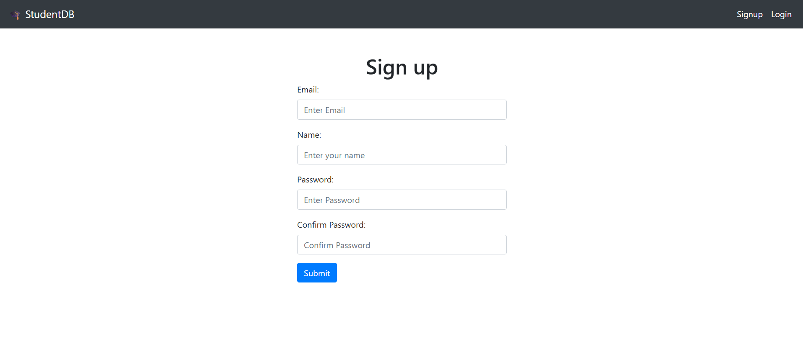
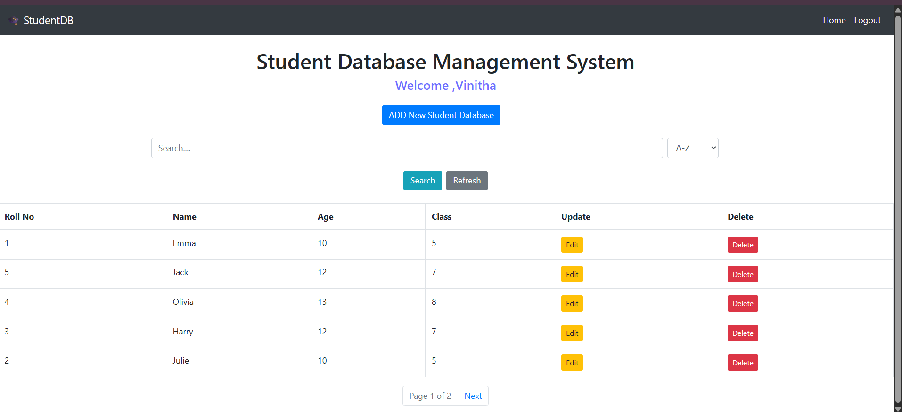
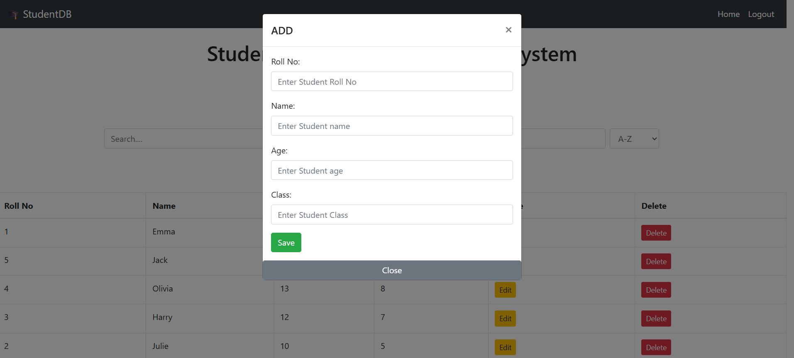
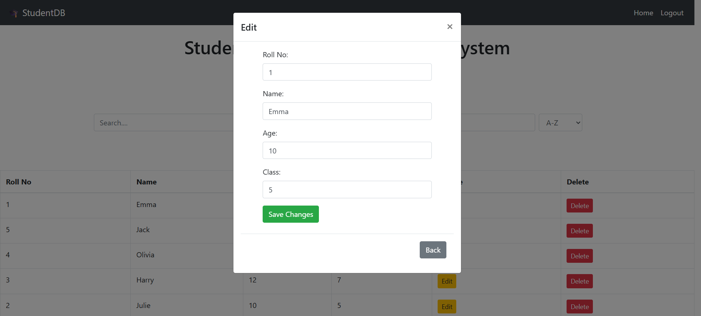

# 🎓 Student Database Management System

A web-based **Student Database Management System** built using **Flask** and **MySQL**. This application allows users to securely manage student records through authentication, search, sorting, pagination, and full CRUD operations.

---

## ✨ Features

* 🔐 User Registration and Login
* 🔒 Secure Password Hashing
* 👤 User-specific Student Records
* ➕ Add Student Records
* ✏️ Edit Student Details
* 🗑️ Delete Student Records
* 🔍 Search Students by Roll Number or Name
* 📊 Sort Student Records
* 📄 Pagination
* 💬 Flash Messages for User Feedback
* ✅ Input Validation
* 🛡️ Duplicate Roll Number Prevention (per user)

---

## 🛠️ Technologies Used

* Python
* Flask
* Flask-SQLAlchemy
* Flask-Login
* Flask-Migrate
* MySQL
* SQLAlchemy ORM
* Bootstrap 4
* HTML
* JavaScript
* Git
* GitHub

---

## 📂 Project Structure

```text
student/
│
├── migrations/
├── website/
│   ├── templates/
│   ├── static/
│   ├── auth.py
│   ├── home.py
│   ├── models.py
│   └── __init__.py
│
├── main.py
├── .gitignore
└── README.md
```

---

## 🚀 Installation

1. Clone the repository

```bash
git clone https://github.com/vinitha3031/Student-Database-Management-System.git
```

2. Navigate to the project folder

```bash
cd Student-Database-Management-System
```

3. Create a virtual environment

```bash
python -m venv .venv
```

4. Activate the virtual environment

Windows

```bash
.venv\Scripts\activate
```

5. Install dependencies

```bash
pip install -r requirements.txt
```

6. Configure your MySQL database.

Update the database URI in your environment variables or configuration.

7. Run the application

```bash
python main.py
```

---

## 📸 Screenshots

### Signup Page



### Home Page



### Add Student



### Edit Student



## 📌 Future Improvements

* Responsive UI improvements
* Profile management
* Export student data
* Dashboard with statistics
* Dark mode

---

## 👩‍💻 Author

**Vinitha G**

GitHub: https://github.com/vinitha3031
