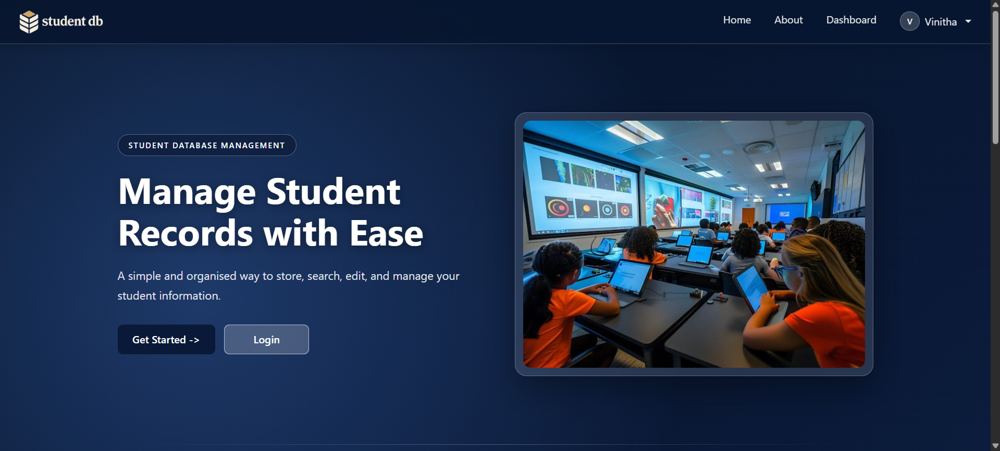
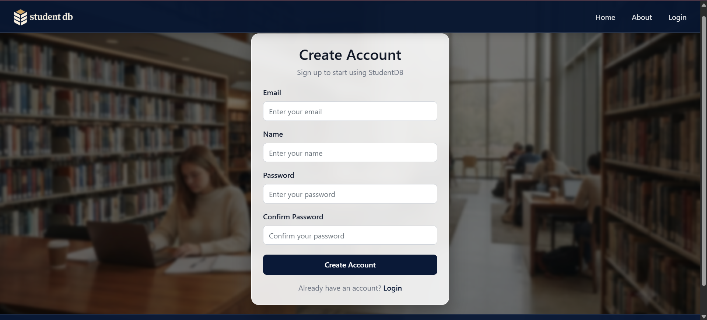
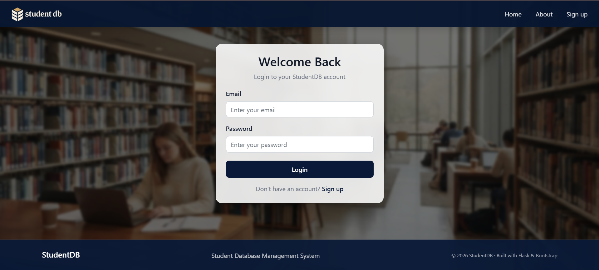
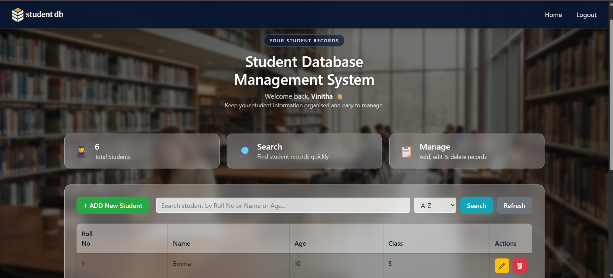
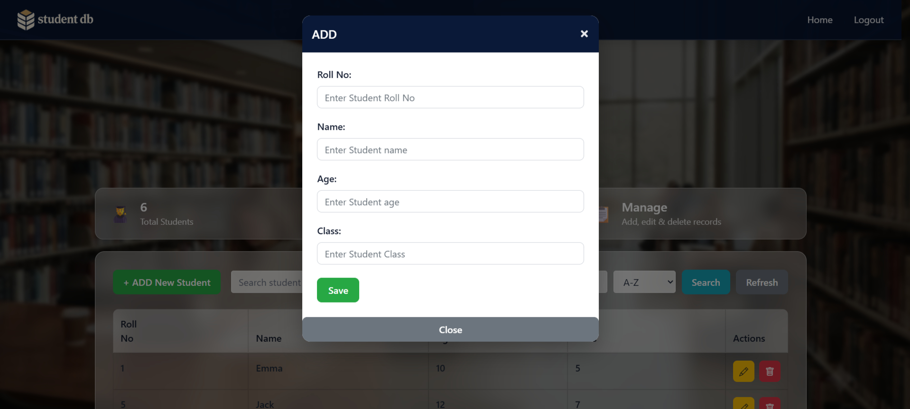
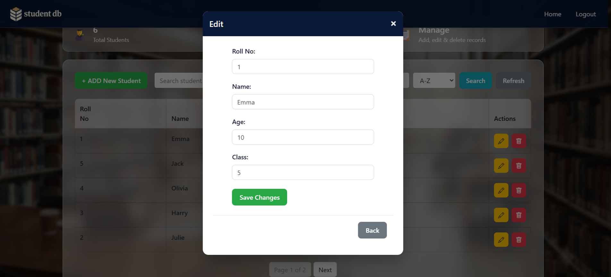

# 🎓 Student Database Management System

A full-stack **Student Database Management System** built with **Flask** and **MySQL**, featuring secure user authentication and user-specific student record management.

The application supports **CRUD operations, search, sorting, pagination, input validation, and duplicate roll number prevention**, with a responsive Bootstrap-based interface.

---

## ✨ Features

- 🔐 User Registration and Login
- 🔒 Secure Password Hashing
- 👤 User-specific Student Records
- ➕ Add Student Records
- ✏️ Edit Student Details
- 🗑️ Delete Student Records
- 🔍 Search Students by Roll Number or Name
- 📊 Sort Student Records
- 📄 Pagination
- 💬 Flash Messages for User Feedback
- ✅ Input Validation
- 🛡️ Duplicate Roll Number Prevention (per user)
- 📱 Responsive User Interface

---

## 🛠️ Technologies Used

- Python
- Flask
- Flask-SQLAlchemy
- Flask-Login
- Flask-Migrate
- MySQL
- SQLAlchemy ORM
- Bootstrap 4
- HTML5
- CSS3
- JavaScript
- Git
- GitHub

---

## 📂 Project Structure

```text
Student-Database-Management-System/
│
├── migrations/
│
├── website/
│   ├── templates/
│   ├── static/
│   ├── auth.py
│   ├── home.py
│   ├── models.py
│   └── __init__.py
│
├── main.py
├── requirements.txt
├── vercel.json
├── .gitignore
└── README.md
````

---

## 🚀 Installation

### 1. Clone the repository

```bash
git clone https://github.com/vinitha3031/Student-Database-Management-System.git
```

### 2. Navigate to the project folder

```bash
cd Student-Database-Management-System
```

### 3. Create a virtual environment

```bash
python -m venv .venv
```

### 4. Activate the virtual environment

**Windows:**

```bash
.venv\Scripts\activate
```

### 5. Install dependencies

```bash
pip install -r requirements.txt
```

### 6. Configure the database

Create a `.env` file in the project root and configure the required environment variables:

```env
SECRET_KEY=your-secret-key
DATABASE_URL=your-mysql-database-url
```

> Do not commit your `.env` file to GitHub.

### 7. Run the application

```bash
python main.py
```

The application will be available locally at:

```text
http://127.0.0.1:5000
```

---

## 📸 Screenshots

### 🏠 Landing Page



### 📝 Signup Page



### 🔐 Login Page



### 📊 Dashboard



### ➕ Add Student



### ✏️ Edit Student



---

## ☁️ Deployment

The application is configured for deployment using **Vercel** with a MySQL database hosted on **Aiven**.

Deployment configuration is included in:

```text
vercel.json
```

Environment variables such as the database connection string and secret key should be configured through the deployment platform rather than committed to the repository.

---

## 📌 Future Improvements

* 👤 Profile Management
* 📤 Export Student Data
* 📈 Dashboard Statistics
* 🌙 Dark Mode
* 🔎 Advanced Search and Filtering
* 📊 Data Visualization

---

## 👩‍💻 Author

**Vinitha G**

GitHub:
[https://github.com/vinitha3031](https://github.com/vinitha3031)

````

